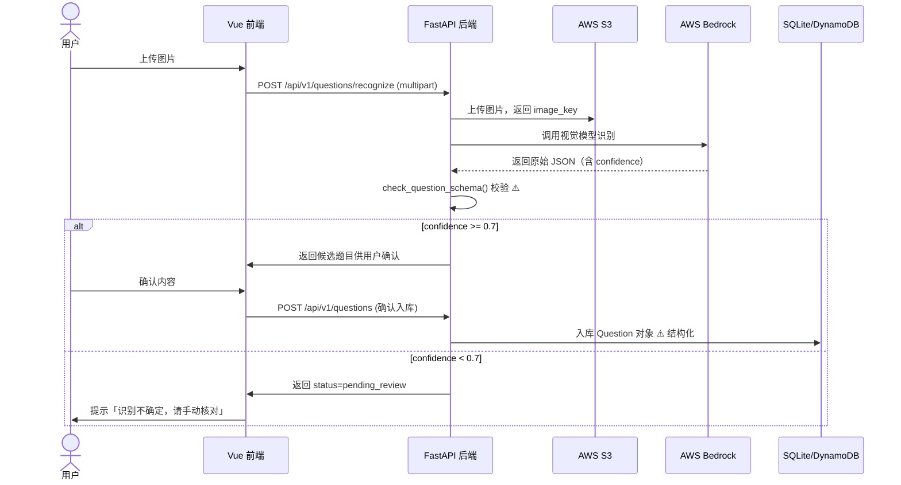

# 错题本 — 架构概览

> AI 生成初稿，人工标注了单向门（⚠️）。

## 技术栈

| 层 | 技术 |
|---|---|
| 后端 | FastAPI + Python 3.12 + SQLAlchemy 2 (async) + Pydantic v2 |
| 前端 | Vue 3 + TypeScript + Vite + Pinia + Vue Router v4 |
| AI 识别 | AWS Bedrock（Claude 视觉模型）|
| 图片存储 | AWS S3 |
| 数据库 | SQLite（本地）/ DynamoDB（生产）|
| 认证 | JWT（python-jose）|

## 数据模型

```
User
 └── Question (user_id FK, MUST 隔离)
      ├── subject_id → Subject
      ├── content: str          ⚠️ 单向门：必须结构化存储
      ├── confidence_score: float
      ├── status: enum(pending_review, confirmed)
      ├── ease_factor: float    ← SM-2 遗忘曲线
      ├── next_review_at: datetime
      └── image_key: str → S3

Subject
 └── name, category

ReviewRecord
 └── question_id, rating(1-5), reviewed_at
```

## 数据流图（拍照识别主线）



## 单向门评审（人工标注）

以下决策被标为 ⚠️ 单向门，改回代价极大，值得写护栏：

### ⚠️ 决策 1：题目内容结构化存储（最重要的单向门）

**是什么**：题目存入 `Question` 对象的结构化字段，而非一个 `raw_text` 裸字符串。

**为什么是单向门**：一旦以裸字符串入库，后续所有功能（按科目筛选、难度标注、
复习推荐、打印排版）都需要重新解析字符串，且历史数据无法自动迁移。

**护栏**：`ci/arch-check.sh` 自动检测是否有代码绕过结构化存储。

### ⚠️ 决策 2：confidence_score 字段强制入库

**是什么**：每条题目记录必须有 `confidence_score` 字段，不允许为 NULL。

**为什么是单向门**：如果早期不存置信度，后续想做「按识别质量过滤」就没有数据依据，
且无法回溯补充（Bedrock 是无状态调用，结果不保存）。

### ⚠️ 决策 3：用户数据隔离策略（`user_id` 外键）

**是什么**：`Question` 表有 `user_id` 列，所有查询必须带此过滤。

**为什么是单向门**：如果早期不做隔离，用户数据混在一起，后续要做隔离需要数据迁移 + 所有查询改写。安全漏洞发现时已有生产数据，风险极高。

### ✅ 决策 4：SQLite → DynamoDB 双栈（双向门）

**是什么**：本地用 SQLite，生产用 DynamoDB，通过 Repository 层抽象切换。

**为什么是双向门**：Repository 模式让 DB 切换只需改 Repository 实现，不影响 Service 层。代价可控，不需要写护栏。

### ✅ 决策 5：SM-2 复习算法（双向门）

**是什么**：使用 SM-2 遗忘曲线算法计算下次复习时间。

**为什么是双向门**：`ease_factor` 字段和 SM-2 计算逻辑封装在 `review_service.py`，替换算法只需改 service，数据字段通用，改回代价不大。

## 架构原则（来自单向门评审）

见 `rules/architecture.md`。
