# 错题本（Wrongbook）架构设计文档

**版本**：1.0  
**日期**：2026-06-24  
**来源**：基于 `2026-06-24-wrongbook-master-srs.md` + `2026-06-24-wrongbook-fullstack-design.md` + Plan 1-7  
**状态**：权威参考，勿直接修改（以 SRS 为准）

---

## 目录

1. [系统整体架构](#1-系统整体架构)
2. [技术栈层次图](#2-技术栈层次图)
3. [后端目录结构与模块依赖](#3-后端目录结构与模块依赖)
4. [前端目录结构与模块依赖](#4-前端目录结构与模块依赖)
5. [数据模型关系图](#5-数据模型关系图)
6. [Question 状态机](#6-question-状态机)
7. [识别主线数据流](#7-识别主线数据流)
8. [识别接口序列图](#8-识别接口序列图)
9. [认证流程序列图](#9-认证流程序列图)
10. [CRUD 操作流程](#10-crud-操作流程)
11. [SM-2 复习算法流程](#11-sm-2-复习算法流程)
12. [复习模块序列图](#12-复习模块序列图)
13. [打印模块流程](#13-打印模块流程)
14. [前端路由与页面结构](#14-前端路由与页面结构)
15. [前端识别状态机](#15-前端识别状态机)
16. [前端组件依赖图](#16-前端组件依赖图)
17. [错误处理层次](#17-错误处理层次)
18. [安全边界与用户隔离](#18-安全边界与用户隔离)
19. [实现顺序与依赖关系](#19-实现顺序与依赖关系)
20. [API 端点全览](#20-api-端点全览)

---

## 1. 系统整体架构

系统由三大部分组成：Vue 3 前端、FastAPI 后端、AWS 外部服务（S3 + Bedrock）。

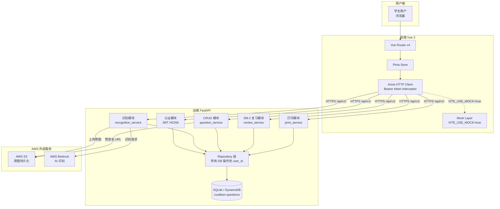

---

## 2. 技术栈层次图

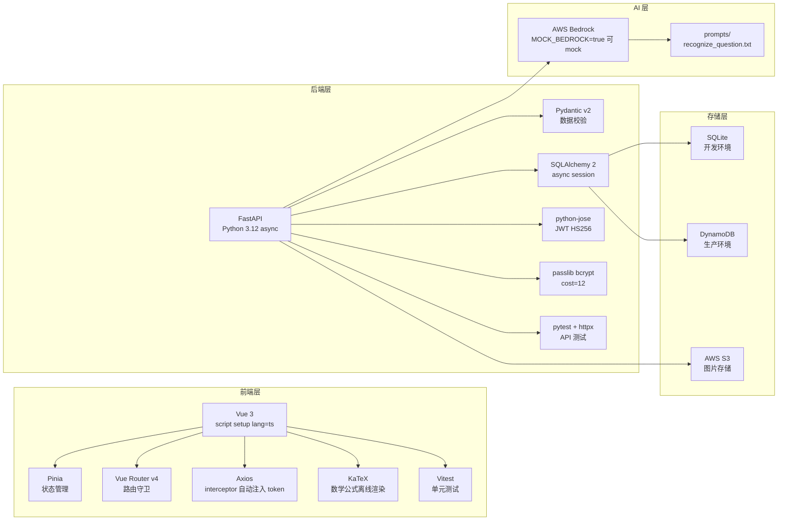

---

## 3. 后端目录结构与模块依赖

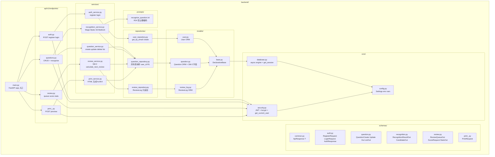

---

## 4. 前端目录结构与模块依赖

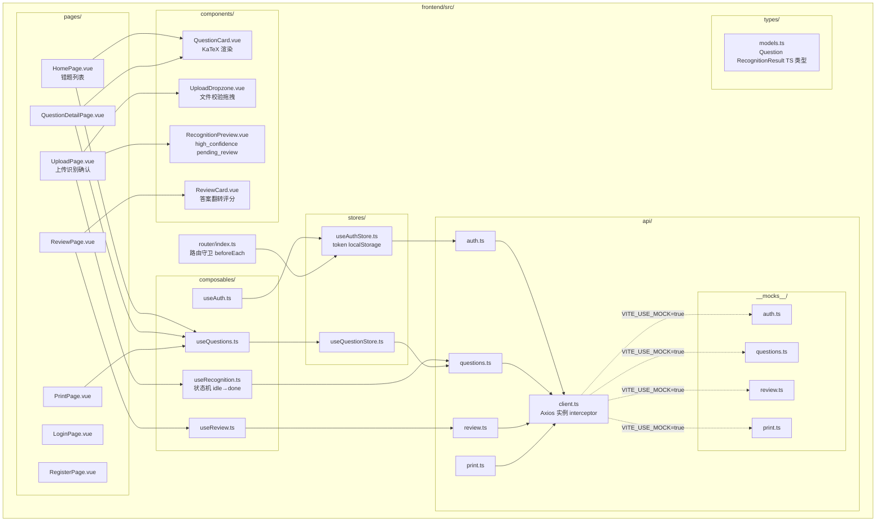

---

## 5. 数据模型关系图

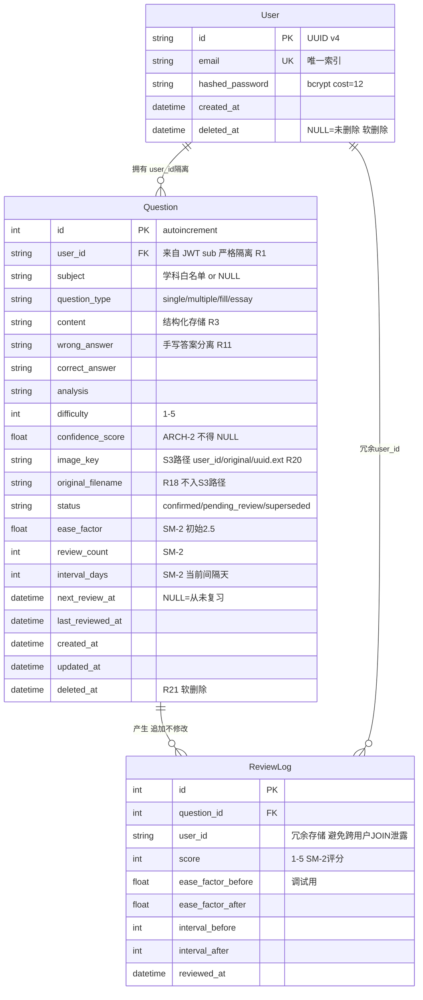

---

## 6. Question 状态机

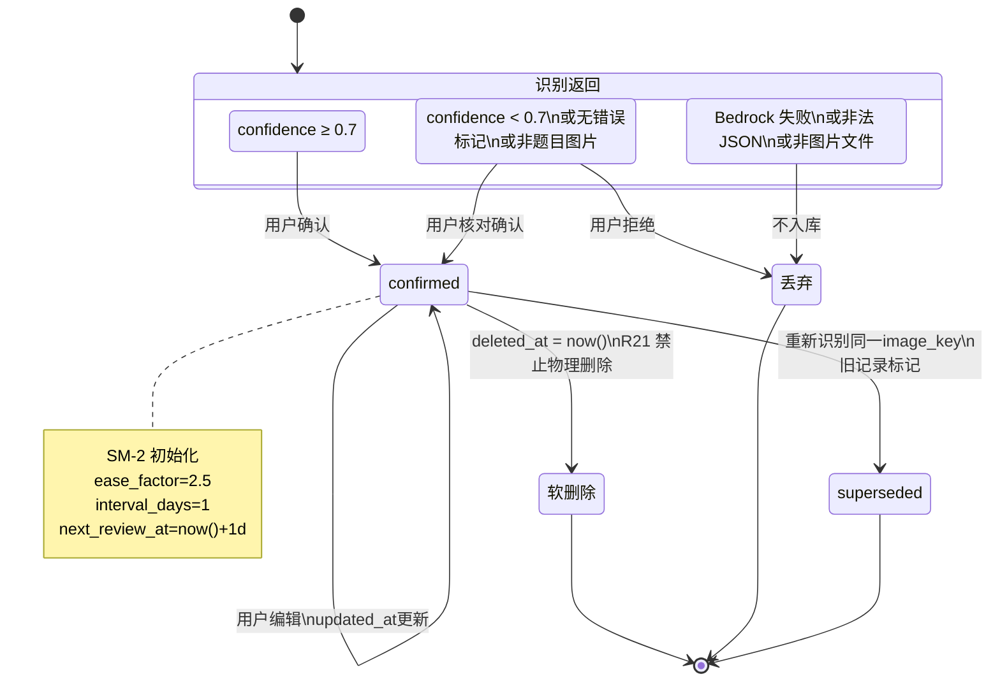

---

## 7. 识别主线数据流

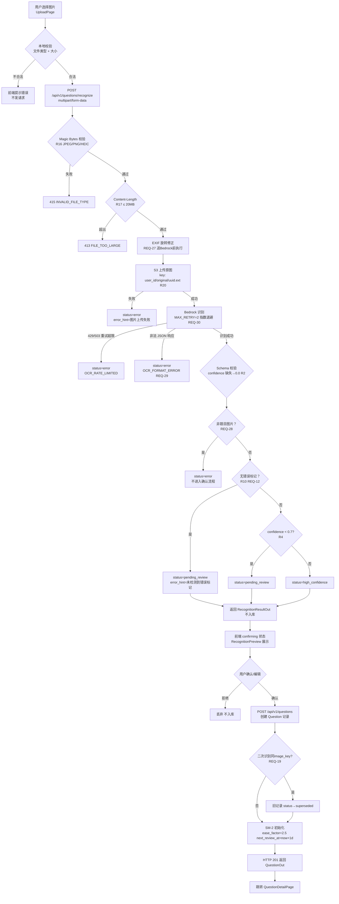

---

## 8. 识别接口序列图

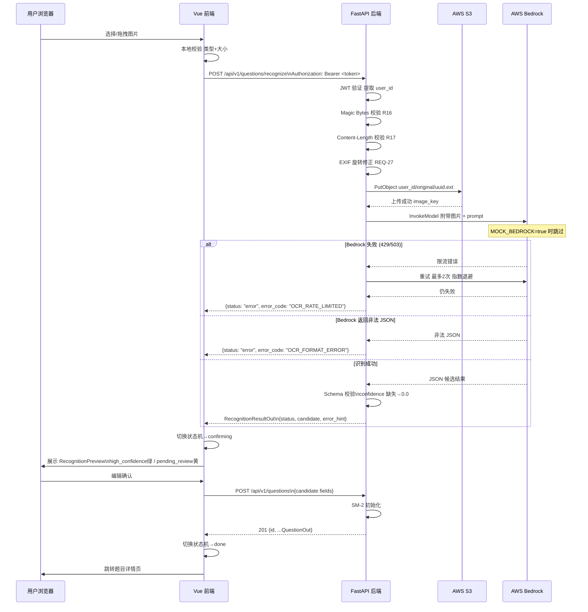

---

## 9. 认证流程序列图

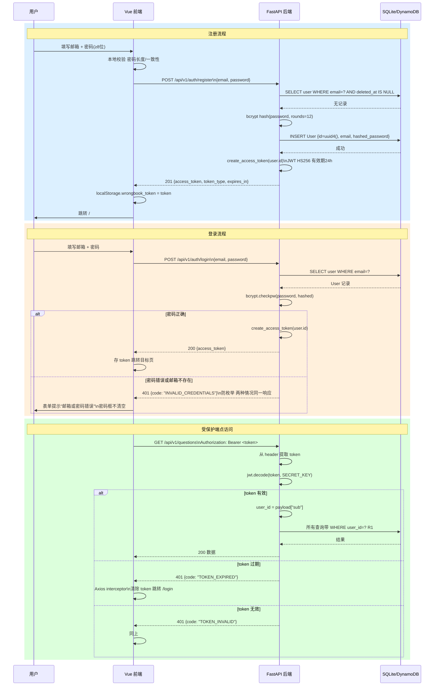

---

## 10. CRUD 操作流程

```mermaid
flowchart LR
    subgraph 列表 GET /questions
        L1[JWT 验证\n提取 user_id] --> L2[QuestionRepository\nWHERE user_id=? AND deleted_at IS NULL]
        L2 --> L3{过滤参数\nsubject difficulty status}
        L3 --> L4[分页\npage page_size default=20]
        L4 --> L5[返回 QuestionListOut\nitems total page page_size]
    end

    subgraph 详情 GET /questions/id
        D1[JWT 验证] --> D2[Repository.get_by_id\nWHERE id=? AND user_id=? AND deleted_at IS NULL]
        D2 --> D3{结果?}
        D3 -->|无| D4[404 NOT_FOUND]
        D3 -->|user_id不符| D5[403 FORBIDDEN R1]
        D3 -->|有| D6[生成预签名 URL\n有效期≤1h R23]
        D6 --> D7[返回 QuestionOut\nimage_url + image_url_expires_at]
    end

    subgraph 更新 PATCH /questions/id
        U1[JWT 验证] --> U2[获取记录 + 用户校验]
        U2 --> U3{字段过滤\n只读字段静默忽略\nuser_id confidence_score image_key}
        U3 --> U4[Pydantic 校验\nsubject白名单 difficulty范围]
        U4 --> U5[UPDATE + updated_at=now()]
        U5 --> U6[返回更新后 QuestionOut]
    end

    subgraph 软删除 DELETE /questions/id
        DEL1[JWT 验证] --> DEL2[获取记录 + 用户校验]
        DEL2 --> DEL3{已删除?}
        DEL3 -->|是| DEL4[404 NOT_FOUND]
        DEL3 -->|否| DEL5[UPDATE deleted_at=now()\nR21 禁止物理删除]
        DEL5 --> DEL6[204 No Content]
    end
```

---

## 11. SM-2 复习算法流程

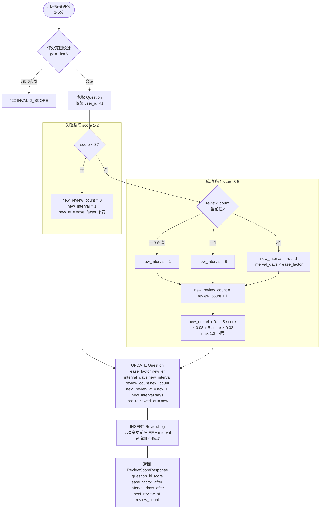

---

## 12. 复习模块序列图

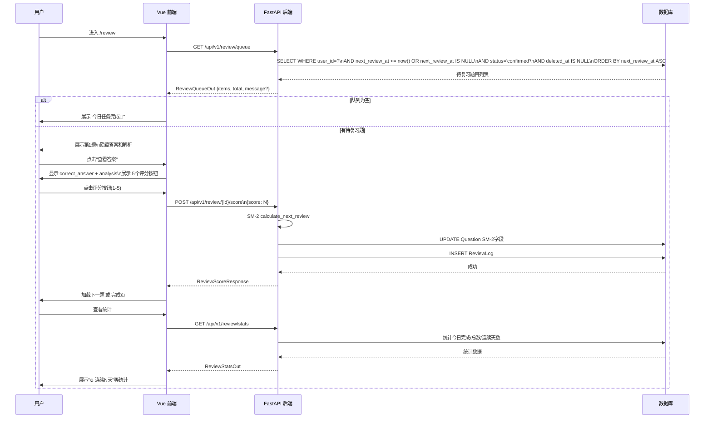

---

## 13. 打印模块流程

```mermaid
flowchart TD
    A[用户进入 /print] --> B[加载错题列表\n多选模式]
    B --> C{选择题目\nmax 50道 REQ-P1}
    C -->|超出50| D[禁用更多选择\n提示最多50道]
    C -->|未选择| E[预览按钮禁用]
    C -->|已选择| F[配置打印选项\n布局 card/list/compact\n是否含答案]

    F --> G[POST /api/v1/print/preview\n{question_ids layout include_answer include_analysis}]

    G --> H[JWT 验证\n过滤掉非当前用户题目 R1\n不报错静默过滤]

    H --> I{遍历 question_ids\n获取 Question 记录}

    I --> J{含 image_key?}
    J -->|是| K[生成预签名 URL\n标注图片有效期1h REQ-P3]
    J -->|否| L[跳过 img 标签]

    K --> M{含 LaTeX?}
    L --> M
    M -->|是| N[嵌入 KaTeX 离线资源\nCSS + JS REQ-P2]
    M -->|否| O[纯文本渲染]

    N --> P{布局选择}
    O --> P

    P -->|card| Q[每题独立卡片\npage-break-inside:avoid REQ-P4]
    P -->|list| R[A4 紧凑列表]
    P -->|compact| S[双栏布局]

    Q --> T{include_answer?}
    R --> T
    S --> T
    T -->|true| U[追加答案 + 解析\n分隔线区分 REQ-P5]
    T -->|false| V[不含答案内容]

    U --> W[返回 text/html\nContent-Type: text/html P95≤5s]
    V --> W
    W --> X[前端 window.open 新标签页]
```

---

## 14. 前端路由与页面结构

```mermaid
graph TD
    subgraph 路由守卫 beforeEach
        GUARD{localStorage\nwrongbook_token?}
    end

    subgraph 公开路由
        LOGIN[/login\nLoginPage.vue\n已登录→跳/]
        REGISTER[/register\nRegisterPage.vue]
    end

    subgraph 受保护路由 需要 token
        HOME[/\nHomePage.vue\n错题列表 无限滚动]
        UPLOAD[/upload\nUploadPage.vue\n拍照识别确认]
        DETAIL[/questions/:id\nQuestionDetailPage.vue\n详情+编辑+删除]
        REVIEW[/review\nReviewPage.vue\nSM-2 复习队列]
        PRINT[/print\nPrintPage.vue\n多选打印]
    end

    GUARD -->|无 token| LOGIN
    GUARD -->|有 token| HOME

    HOME -->|点击上传按钮| UPLOAD
    HOME -->|点击题目卡片| DETAIL
    HOME -->|点击复习入口| REVIEW
    HOME -->|点击打印入口| PRINT

    UPLOAD -->|识别确认完成| DETAIL
    DETAIL -->|编辑保存| DETAIL
    DETAIL -->|软删除确认| HOME

    LOGIN -->|登录成功 redirect| HOME
    REGISTER -->|注册成功| HOME

    subgraph Axios Interceptor
        AXIOS_401[401 响应\n→清除 token\n→跳转 /login]
        AXIOS_NET[网络错误\n→Toast 网络异常]
    end
```

---

## 15. 前端识别状态机

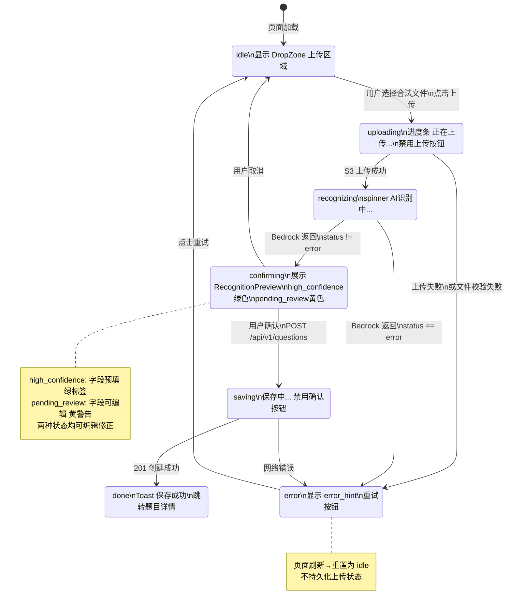

---

## 16. 前端组件依赖图

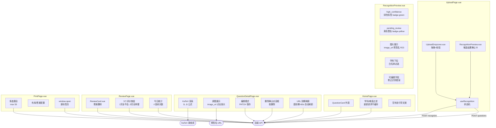

---

## 17. 错误处理层次

```mermaid
graph TD
    subgraph 前端错误处理
        FE1[本地校验层\n文件类型 文件大小 表单字段]
        FE2[Axios Request Interceptor\n注入 Bearer token]
        FE3[Axios Response Interceptor\n401→清除token→跳/login]
        FE4[组件层\nstatus=error→error_hint+重试\npending_review→黄色警告]
        FE5[全局 Toast\n网络错误 请重试]
    end

    subgraph 后端错误处理
        BE1[路由层 FastAPI\nPydantic 422 自动校验]
        BE2[HTTPException Handler\nmain.py 统一格式化\ndata=null error={code message}]
        BE3[全局 Exception Handler\n500 不暴露 stack trace]
        BE4[业务降级\nBedrock/S3失败→status=error\n不抛5xx]
    end

    subgraph 语义错误码
        EC1[INVALID_CREDENTIALS 401]
        EC2[TOKEN_EXPIRED 401]
        EC3[TOKEN_INVALID 401]
        EC4[DUPLICATE_EMAIL 409]
        EC5[FORBIDDEN 403 R1跨用户]
        EC6[NOT_FOUND 404]
        EC7[INVALID_FILE_TYPE 415]
        EC8[FILE_TOO_LARGE 413]
        EC9[OCR_FAILED 200 业务错误]
        EC10[OCR_FORMAT_ERROR 200]
        EC11[OCR_RATE_LIMITED 200]
        EC12[INVALID_SCORE 422]
        EC13[VALIDATION_ERROR 422]
    end

    FE1 -->|不合法不发请求| 用户提示
    FE2 --> 后端
    后端 --> BE1
    BE1 --> BE2
    BE2 -->|统一格式| FE3
    BE3 --> FE5
    BE4 -->|降级响应| FE4

    BE2 --> EC1
    BE2 --> EC2
    BE2 --> EC3
    BE2 --> EC4
    BE2 --> EC5
    BE2 --> EC6
    BE2 --> EC7
    BE2 --> EC8
    BE2 --> EC9
    BE2 --> EC10
    BE2 --> EC11
    BE2 --> EC12
    BE2 --> EC13
```

---

## 18. 安全边界与用户隔离

```mermaid
graph TD
    subgraph 安全约束全景
        R1[R1 用户数据隔离\n所有DB查询含WHERE user_id=?\nBOLA 防御]
        R16[R16 Magic Bytes 校验\n不信任 Content-Type\n拒绝非图片文件]
        R17[R17 20MB 上限\nContent-Length前置检查\n不读入内存]
        R18[R18 UUID重命名\n原始文件名存 original_filename\n不入S3路径]
        R19[R19 S3 original/只写一次\n禁止覆盖或删除原图]
        R20[R20 S3 key格式\nuser_id/original/uuid.ext]
        R21[R21 软删除\ndeleted_at=now()\n禁止物理删除]
        R22[R22 user_id来源\n只从JWT sub提取\n拒绝客户端传入]
        R23[R23 预签名URL\n≤1h有效期\n不暴露S3原始路径]
        R24[R24 Prompt外置\nprompts/目录\n禁止硬编码]
        BCRYPT[密码存储\nbcrypt cost=12\n$2b$12$开头]
        JWT24H[JWT 24h有效期\nHS256 SECRET_KEY]
        ENUM[防枚举攻击\n邮箱不存在和密码错误\n返回同一错误码]
    end

    subgraph 数据访问控制
        REQ[HTTP 请求] --> JWT_CHECK[JWT 验证\nget_current_user]
        JWT_CHECK -->|提取 user_id| REPO[Repository 层]
        REPO -->|WHERE user_id=?| DB[(数据库)]
        REPO -->|额外校验| OWN{question.user_id\n== current_user.id?}
        OWN -->|否| FORBIDDEN[403 FORBIDDEN]
        OWN -->|是| DATA[返回数据]
    end

    subgraph S3 访问控制
        UPLOAD[上传] -->|PutObject\nkey=user_id/original/uuid| S3B[(S3 Bucket\n禁公开访问)]
        DOWNLOAD[下载] -->|GeneratePresignedUrl\n≤1h R23| PRESIGN[预签名 URL]
        S3B -->|禁止| PUBLIC[公网直接访问]
    end
```

---

## 19. 实现顺序与依赖关系

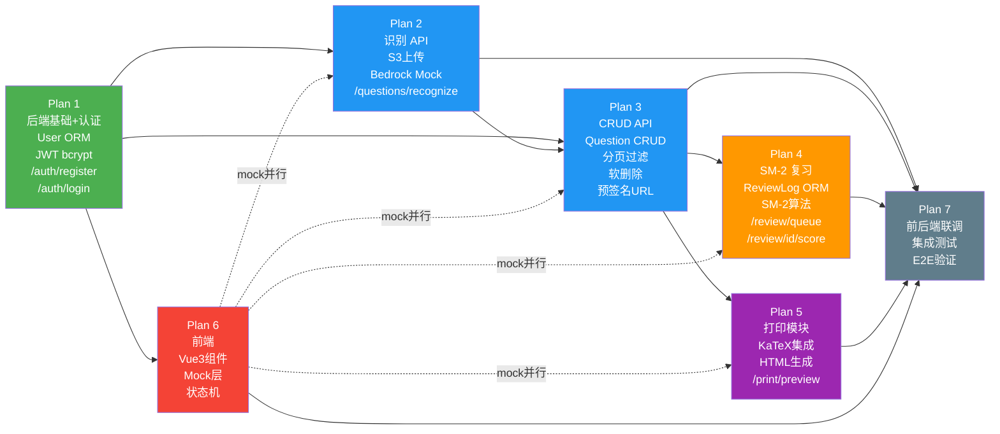

---

## 20. API 端点全览

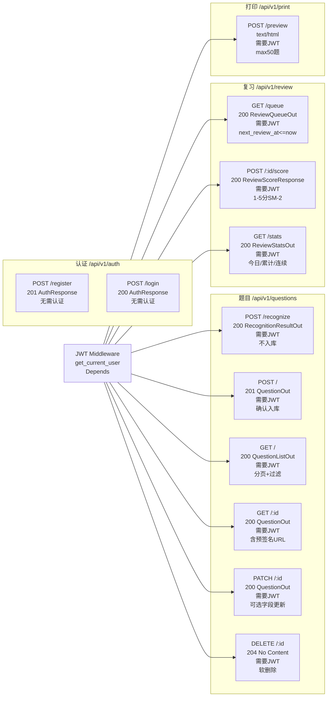

---

## 附录：关键业务边界矩阵

| 层 | 致命性 | 边界场景 | 处理决策 | 规则/REQ |
|---|---|---|---|---|
| 筛选层 | ★★★★★ | 无错误标记图片 | `pending_review` + 提示 | R10 / REQ-12 |
| 内容层 | ★★★★★ | 手写答案混入题干 | `wrong_answer` 分离 | R11 / REQ-14 |
| 内容层 | ★★★★★ | 几何图/电路图 | 强制保留 `image_key` | R12 / REQ-15 |
| AI特性层 | ★★★★★ | Bedrock confidence 缺失 | 默认 0.0 不得 1.0 | R2 / REQ-6 |
| AI特性层 | ★★★★★ | 重复识别同一图片 | 旧记录 `superseded` | R14 / REQ-19 |
| AI特性层 | ★★★★★ | Bedrock 返回非法 JSON | `status=error` 不抛500 | REQ-29 |
| 安全层 | ★★★★★ | user_id 从 JWT sub 提取 | 禁止客户端传入 | R22 |
| 安全层 | ★★★★★ | 跨用户访问资源 | 403 FORBIDDEN | R1 |
| 图像层 | ★★★★★ | EXIF 旋转 | 送 Bedrock 前修正 | REQ-27 |
| 文件层 | ★★★★★ | 非图片文件伪装 | Magic Bytes 校验 | R16 |
